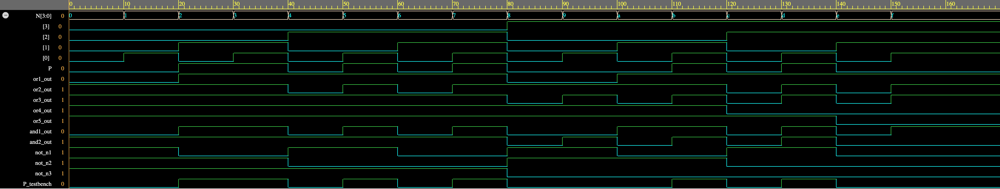

# Detector de Números Primos de 4 bits

**Universidade Federal de Minas Gerais — Introdução a Sistemas Lógicos**

> *Autor:* Rodrigo de Freitas Lanaza — Matrícula: 2025051446 — 23 de maio de 2026

---

## 1. Introdução

Em sistemas digitais, é frequente a necessidade de identificar propriedades específicas de valores numéricos representados em formato binário. Um exemplo clássico desta aplicação é a identificação de números primos, definidos como números inteiros maiores que 1 que são divisíveis apenas por 1 e por si mesmos.

O objetivo deste trabalho prático é projetar e implementar um circuito lógico combinacional capaz de detectar se um dado número binário de 4 bits representa um número primo. A implementação deve ser realizada utilizando a linguagem de descrição de hardware Verilog, adotando um estilo de modelação estrutural.

O circuito projetado recebe como entrada um valor binário de 4 bits (`N[3:0]`), o que possibilita representar valores decimais num intervalo de 0 a 15. A saída do circuito consiste num único bit (`P`), tal que `P = 1` indica que a entrada corresponde a um número primo, e `P = 0` indica que o número não é primo. Dentro do limite de 4 bits, os valores que ativam a saída do sistema são: **2, 3, 5, 7, 11 e 13**.

---

## 2. Decisões de Implementação do Circuito

Para montar o circuito que detecta números primos, foi construído um circuito combinacional em Verilog no estilo estrutural. Não foram utilizadas descrições comportamentais completas (`if` e `always`). O código Verilog e o diagrama lógico foram construídos apenas conectando portas lógicas básicas **AND**, **OR** e **NOT**.

Para que o circuito ficasse o menor possível, a função foi simplificada usando o Mapa de Karnaugh na forma **PoS** (Product of Sums).

Foram utilizadas em todas as portas lógicas somente portas com duas entradas. Por causa dessa limitação, quando a equação exigia somar três variáveis ao mesmo tempo, duas portas OR foram ligadas em sequência. Já para a multiplicação final de todos os termos, as portas AND foram organizadas juntando os sinais de dois em dois, até chegar ao resultado final.

---

## 3. Tabela Verdade

A tabela verdade abaixo apresenta a especificação completa do comportamento esperado para o circuito combinacional. A função de saída (`P`) assume o valor lógico `1` exclusivamente para as entradas cujo valor decimal seja um número primo.

| Decimal | Binário `N[3:0]` | Saída `P` |
|:-------:|:----------------:|:---------:|
| 0       | 0000             | 0         |
| 1       | 0001             | 0         |
| **2**   | **0010**         | **1**     |
| **3**   | **0011**         | **1**     |
| 4       | 0100             | 0         |
| **5**   | **0101**         | **1**     |
| 6       | 0110             | 0         |
| **7**   | **0111**         | **1**     |
| 8       | 1000             | 0         |
| 9       | 1001             | 0         |
| 10      | 1010             | 0         |
| **11**  | **1011**         | **1**     |
| 12      | 1100             | 0         |
| **13**  | **1101**         | **1**     |
| 14      | 1110             | 0         |
| 15      | 1111             | 0         |

---

## 4. Forma Canônica

A forma canônica descreve a função lógica diretamente a partir da tabela verdade. Pode ser expressa como a **Soma de Mintermos** (focando nas linhas onde a saída é 1) ou como o **Produto de Maxtermos** (focando nas linhas onde a saída é 0).

Considerando o vetor de entrada `N[3:0]` com as variáveis N₃, N₂, N₁ e N₀ (sendo N₃ o bit mais significativo), a saída `P = 1` para os valores decimais: 2, 3, 5, 7, 11 e 13.

### 4.1 Soma de Mintermos

$$P(N_3, N_2, N_1, N_0) = \sum m(2, 3, 5, 7, 11, 13)$$

A expressão booleana expandida (Soma de Produtos) é:

$$P = (\overline{N_3}\,\overline{N_2}\,N_1\,\overline{N_0}) + (\overline{N_3}\,\overline{N_2}\,N_1\,N_0) + (\overline{N_3}\,N_2\,\overline{N_1}\,N_0) + (\overline{N_3}\,N_2\,N_1\,N_0) + (N_3\,\overline{N_2}\,N_1\,N_0) + (N_3\,N_2\,\overline{N_1}\,N_0)$$

### 4.2 Produto de Maxtermos

$$P(N_3, N_2, N_1, N_0) = \prod M(0, 1, 4, 6, 8, 9, 10, 12, 14, 15)$$

A expressão booleana expandida (Produto de Somas) é:

$$P = (N_3 + N_2 + N_1 + N_0) \cdot (N_3 + N_2 + N_1 + \overline{N_0})$$
$$\cdot\; (N_3 + \overline{N_2} + N_1 + N_0) \cdot (N_3 + \overline{N_2} + \overline{N_1} + N_0)$$
$$\cdot\; (\overline{N_3} + N_2 + N_1 + N_0) \cdot (\overline{N_3} + N_2 + N_1 + \overline{N_0})$$
$$\cdot\; (\overline{N_3} + N_2 + \overline{N_1} + N_0) \cdot (\overline{N_3} + \overline{N_2} + N_1 + N_0)$$
$$\cdot\; (\overline{N_3} + \overline{N_2} + \overline{N_1} + N_0) \cdot (\overline{N_3} + \overline{N_2} + \overline{N_1} + \overline{N_0})$$

---

## 5. Mapa de Karnaugh

Para obter a forma simplificada em Produto de Somas (PoS), mapeamos os maxtermos da função, que correspondem às combinações binárias cuja saída é `0` (números não primos).

### 5.1 Mapa de Karnaugh (valores)

```
         N3N2
N1N0  |  00  |  01  |  11  |  10
------+------+------+------+------
  00  |  0₀  |  0₄  |  0₁₂ |  0₈
  01  |  0₁  |  1₅  |  1₁₃ |  0₉
  11  |  1₃  |  1₇  |  0₁₅ |  1₁₁
  10  |  1₂  |  0₆  |  0₁₄ |  0₁₀
```

### 5.2 Mapa de Karnaugh (Implicantes Primos Essenciais)

```
         N3N2
N1N0  |  00  |  01  |  11  |  10
------+------+------+------+------
  00  | [0   |  0   |  0   |  0]   ← Vermelho (0,1,8,9)
  01  | [0]  |  1   |  1   | [0]
  11  |  1   |  1   | [0   | [0]   ← Laranja (14,15) / Azul (8,10,12,14)
  10  |  1   | [0   |  0]  |  0    ← Verde (4,6,12,14)
```

---

## 6. Minimização

### 6.1 Classificação dos Implicantes

**Implicantes Primos Encontrados:** (0,1,8,9), (4,6,12,14), (8,10,12,14), (14,15) e (0,4,8,12).

**Implicantes Primos Essenciais:**

| Laço | Células | Exclusividade | Termo |
|------|---------|---------------|-------|
| 🔴 Vermelho | (0, 1, 8, 9)   | Cobre únicos: células 1 e 9  | $(N_2 + N_1)$ |
| 🟢 Verde    | (4, 6, 12, 14) | Cobre único: célula 6        | $(\overline{N_2} + N_0)$ |
| 🔵 Azul     | (8, 10, 12, 14)| Cobre único: célula 10       | $(\overline{N_3} + N_0)$ |
| 🟠 Laranja  | (14, 15)       | Cobre único: célula 15       | $(\overline{N_3} + \overline{N_2} + \overline{N_1})$ |

**Implicante Primo Não Essencial:** o grupo (0, 4, 8, 12) foi descartado, pois todos os seus zeros já são cobertos pelos grupos essenciais.

### 6.2 Função Minimizada (PoS)

$$\boxed{P(N_3, N_2, N_1, N_0) = (N_2 + N_1) \cdot (\overline{N_2} + N_0) \cdot (\overline{N_3} + N_0) \cdot (\overline{N_3} + \overline{N_2} + \overline{N_1})}$$

---

## 7. Diagrama Lógico do Circuito

O circuito implementa diretamente a equação PoS minimizada usando portas **AND**, **OR** e **NOT** de 2 entradas cada. Para o termo de 3 variáveis, duas portas OR foram conectadas em cascata. O produto final dos 4 termos usa 3 portas AND encadeadas.

```
N2 ──────────────────────────────┐
                                 ├─[OR]── or1_out ──┐
N1 ──────────────────────────────┘                  ├─[AND]── and1_out ──┐
                                                    │                    │
N2 ──[NOT]── not_n2 ──┐                             │                    │
                      ├─[OR]── or2_out ─────────────┘                    ├─[AND]── P
N0 ───────────────────┘                                                  │
                                                                         │
N3 ──[NOT]── not_n3 ──┐                             ┌─[AND]── and2_out ──┘
                      ├─[OR]── or3_out ─────────────┤
N0 ───────────────────┘                             │
                                                    │
N3 ──[NOT]── not_n3 ──┐                             │
                      ├─[OR]── or4_out ──┐          │
N2 ──[NOT]── not_n2 ──┘                  ├─[OR]── or5_out ──┘
                                         │
N1 ──[NOT]── not_n1 ─────────────────────┘
```

---

## 8. Códigos Fonte em Verilog

### 8.1 Circuito Principal (`design.sv`)

```verilog
module prime_detector(
    input wire [3:0] N,
    output wire P
);

    wire not_n3, not_n2, not_n1;
    wire or1_out, or2_out, or3_out, or4_out, or5_out;
    wire and1_out, and2_out;

    not inv_n3 (not_n3, N[3]);
    not inv_n2 (not_n2, N[2]);
    not inv_n1 (not_n1, N[1]);

    or soma1 (or1_out, N[2],   N[1]);
    or soma2 (or2_out, not_n2, N[0]);
    or soma3 (or3_out, not_n3, N[0]);
    or soma4 (or4_out, not_n3, not_n2);
    or soma5 (or5_out, or4_out, not_n1);

    and mult1 (and1_out, or1_out, or2_out);
    and mult2 (and2_out, or3_out, or5_out);
    and mult3 (P, and1_out, and2_out);

endmodule
```

### 8.2 Ambiente de Simulação (`testbench.sv`)

```verilog
module prime_detector_testbench;

    reg [3:0] N_testbench;
    wire P_testbench;
    integer i;

    prime_detector prime_detector (
        .N(N_testbench),
        .P(P_testbench)
    );

    initial begin
        $dumpfile("dump.vcd");
        $dumpvars(1, prime_detector_testbench);

        $display("-------------------------------------------------------");
        $display(" time (ns) |      input       | Decimal  | Prime?");
        $display("-------------------------------------------------------");
        $monitor("   %4d     |       %4b        |   %2d    |      %b",
                    $time, N_testbench, N_testbench, P_testbench);

        for (i = 0; i < 16; i = i + 1) begin
            N_testbench = i;
            #10;
        end

        #10;
        $finish;
    end

endmodule
```

---

## 9. Formas de Onda do Testbench

Para validar o funcionamento do circuito projetado, foi gerado o gráfico de formas de onda (waveforms). O gráfico mostra a variação do sinal de saída (`P_testbench`) e as entradas de todos os valores binários possíveis (de 0 a 15) no barramento de entrada (`N_testbench`).

A saída `P` ativa-se perfeitamente em sincronia com as entradas equivalentes aos números primos: **2, 3, 5, 7, 11 e 13**.


